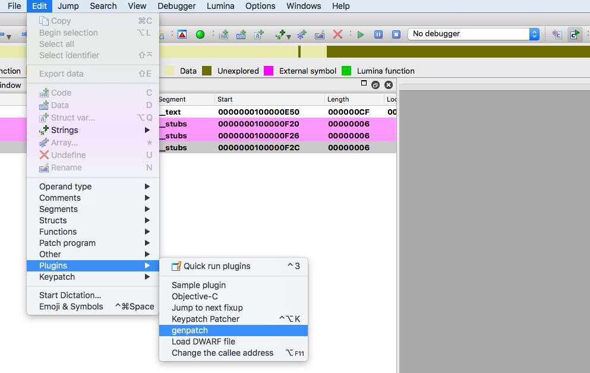

# genpatch
genpatch is IDA plugin that generates a python script for patching binary from `Patched Byte` on IDA.
genpatch is confirmed to work on IDA Pro 7.x.

## Background
During reverse engineering, we often apply the same patch to another binary. For example, when applying patch for bypassing SSL pinning. Launching IDA just to patch is cumbersome, but patching from the CUI is more convenient, it's easy to share with others who are not familiar with IDA.

# Installation
Copy file `genpatch.py`, `patch_template.txt` to IDA Plugin folder, then restart IDA Pro to use genpatch.

- On Windows, the folder is at C:\Program Files (x86)\IDA 7.2\plugins
- On MacOS, the folder is at /Applications/IDA\ Pro\ 7.2/idaq.app/Contents/MacOS/plugins
- On Linux, the folder may be at /opt/IDA/plugins/

# How to Use
After applying the patch using IDA, click `Edit -> Plugins -> genpatch` button.



If patch script is successfully generated, a dialog similar to following appears:


## Patching Script Example

```python
#!/usr/bin/env python
# coding: UTF-8

import binascii
import os
import re
import sys

target_path = sys.argv[1]
target_data = None
with open(target_path, 'rb') as target_file:
    target_data = binascii.hexlify(target_file.read()).decode('utf-8')

# address: 0x100000ecb
# function name: __text: _main
# comment: Keypatch modified this from:   jz loc_100000EF6 Keypatch padded NOP to next boundary: 4 bytes
matches = re.findall('0f8425000000', target_data)
if len(matches) == 1:
    target_data = target_data.replace('0f8425000000', '752990909090')
else:
    print("Patch pattern isn't unique")
    sys.exit()

result_path = target_path + '_patched'
with open(result_path, "wb") as result_file:
    if sys.version_info[0] >= 3:
        result_file.write(bytes.fromhex(target_data))
    else:
        result_file.write(target_data.decode("hex"))

print("Successfully generated patched binary to '%s'" % result_path)
```

# License
The MIT License
